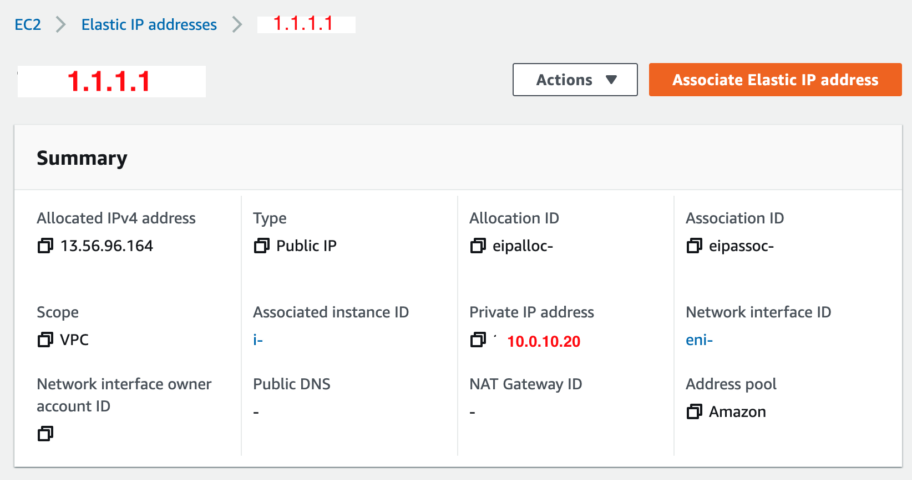
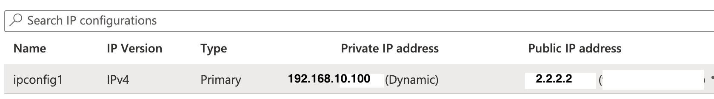

# BIGIP_NAPT_IPSEC

This repository documents how to setup an IPSec tunnel between two BIG-IP instances, one in Azure and one in AWS.

# Introduction 

The goal is to setup a site to site IPSec VPN connection between two networks. Both networks have a BIG-IP. The BIG-IP's create and terminate IPSec tunnels. Each network has routes to the other network environment via BIG-IP. The BIG-IP's route traffic through IPSec tunnels. A main requirement is that the tunnels are transparent, meaning that network devices at each side can see the source IP Address of the network devices in the other network.

This documentation describes the specific configuration steps for Azure and AWS that are required for the cloud environments to allow transparent routing of BIG-IP.

## Network overview

This is the network design for this setup

## General thoughts for Azure and AWS deployments

Azure and AWS provide private virtual network infrastructures. They are called Virtual Network (VN) in Azure and Virtual Private Clouds (VPC) in AWS. VN and VPC are networks with private, non routable IP addresses.   
There are multiple ways to access services within a VN or VPC from the public internet.  It can be done by NATing a public IP to a private IP. 
In AWS the configuration object for this is called an Elastic IP.  
In Azure the mapping happens on the network interface IP configuration, with assigning a public IP to a private IP.

## How does this compare to traditional network designs?

A good comparison is a local network with only private IP addresses that connects to the internet with a router. The router does Network Address Translation (NAT) towards the public Internet. The NAT is a 1:1 NAT, so services on the local network can be directly reached from the Internet.

In AWS the NAT is configured at the Elastic IP object  

In Azure the NAT is configured at the network interface IP configuration level.
 
This is configured under: Network_interface/IP configurations

## Cloud provider environment configuration

Before we start the BIG-IP configuration, we need to make sure the cloud provider network is configured to allow the end-to-end IPSec configuration.

### Azure Virtual Network configuration

[Click here for the Azure configuration details.](./documentation/Azure_preparation.md)

### AWS VPC configuration

[Click here for the AWS VPC configuration details](./documentation/AWS_preparation.md)

### BIG-IP configuration 

[Click here for the BIG-IP configuration steps.](./documentation/BIG_IP_IPsec_config.md)

### Troubleshooting Tips

[Click here for the BIG-IP configuration steps.](./documentation/troubleshooting.md)
