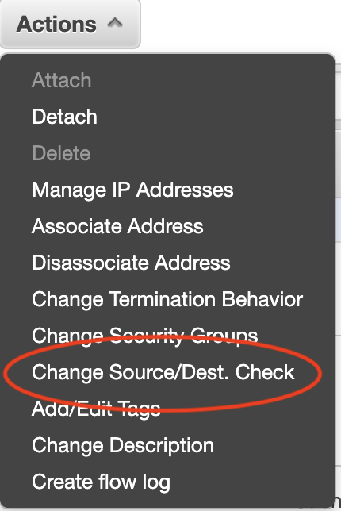
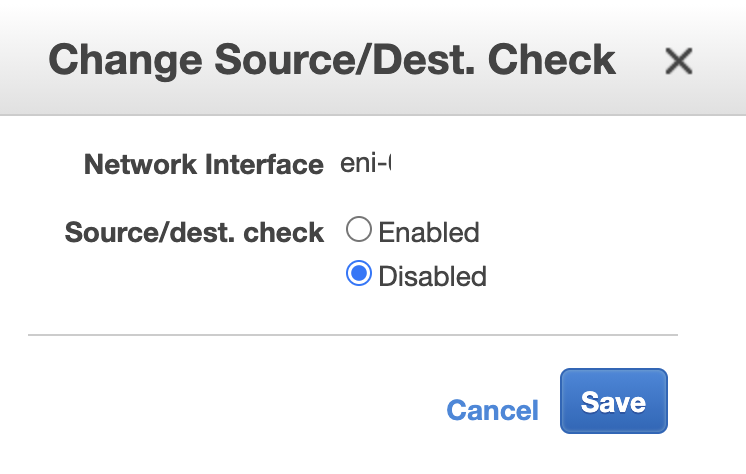

# Preparing AWS VPC for IPSec tunneled traffic

The goal of this setup is to create a site to side IPSec VPN between two Networks.

## Number of interfaces for BIG-IP

In this environment BIG-IP will have the minimum number of recommended interfaces. It uses one management interface and one Data interface for IPsec termination. It is possible for BIG-IP to have additional interfaces, but it is not necessary to have more interfaces for this setup.

## AWS specific settings for BIG-IP

In this setup, BIG-IP routes traffic from the AWS network to the Azure network through the IPsec tunnel. BIG-IP should not modify source or destination IP Address.

Per default, AWS does not allow packets to leave a network interface where the source IP is not configured as an interface IP.<br>
To change this default behaviour and enable routing on a network interface, disable **"Source/Dest. Check"**

This change needs to be done on every interface that BIG-IP routes traffic.

### Steps to disable "Source/Dest. Check"

1. In AWS GUI, go to *"EC2/Network & Security/Network Interfaces"* and select the "eni-id" of your BIG-IP data interface.
1. From the menu bar click on Actions/Change 

    

1. select the radio button for "disabled" and click save

    

## Network Diagram 

## Security Groups

The security Group for the BIG-IP data interface needs to have following ports allowed:

Incoming:

```
1) UDP 500
2) UDP 4500
```

**Route Table**

AWS requires a route table entry that routes traffic to the Azure environment via the BIG-IP Network interface (ENI).

***

[back to Readme](README.md)

[see Azure environment settings](Azure_preparation.md)

[forward to BIG-IP configuration](BIG_IP_IPsec_config.md)