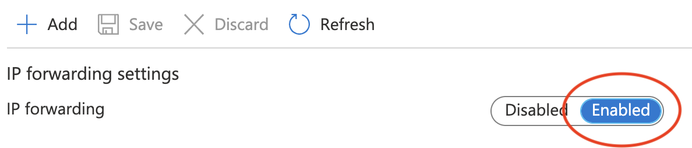
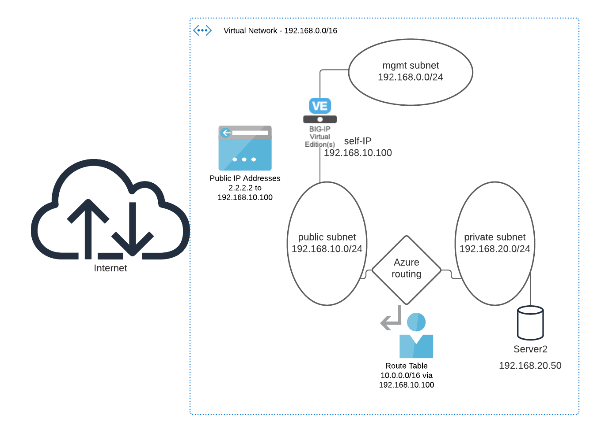

# Preparing Azure VN for IPSec tunneled traffic

The goal of this setup is to create a site to side IPSec VPN between two Networks.

## Number of interfaces for BIG-IP

In this environment BIG-IP will have the minimum number of recommended interfaces. It uses one management interface and one Data interface for IPsec termination. It is possible for BIG-IP to have additional interfaces, but it is not necessary to have more interfaces for this setup.

## Azure specific settings for BIG-IP

In this setup, BIG-IP routes traffic from the Azure network to the AWS network through the IPsec tunnel. BIG-IP should not modify source or destination IP Address.

Per default, Azure does not allow packets to leave a network interface where the source IP is not configured as an interface IP.<br>
To change this default behaviour and enable routing on a network interface, enable **"IP forwarding"**

This change needs to be done on every interface that BIG-IP routes traffic.

### Steps to enable "IP forwarding"

1. In Azure GUI, open the network interface setting of BIG-IP's data interface. 

    Go to *"IP configurations"* and enable IP forwarding:<br><br>

    


This setting has to be enabled on all BIG-IP interfaces that need to route traffic.

## Azure Network Diagram 



## Security Groups

The security Group for the BIG-IP data interface needs to have following ports allowed:

Incoming:

```
1) scr ip: <public IP of AWS BIG-IP> protocol UDP port 500
2) scr ip: <public IP of AWS BIG-IP> protocol UDP port 4500
```

**Route Table**

Azure requires a route table entry that routes traffic to the Azure environment via the BIG-IP Network interface (ENI).
***

[back to readme](../README.md)

[see AWS environment settings](AWS_preparation.md)

[forward to BIG-IP configuration](BIG_IP_IPsec_config.md)