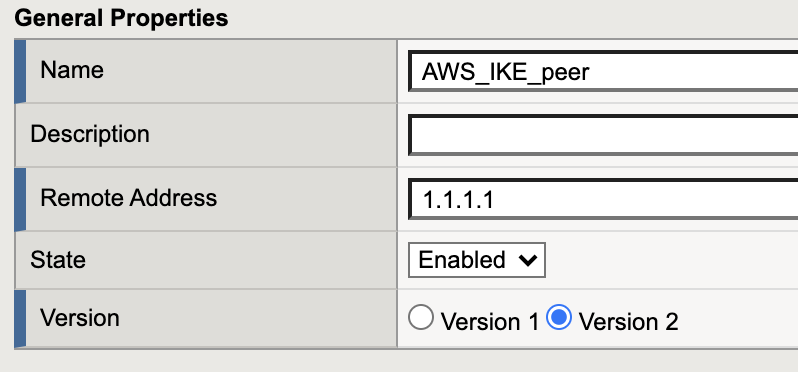
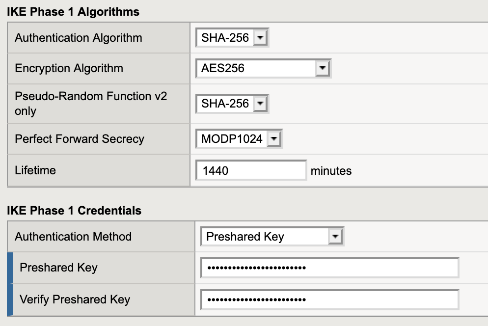
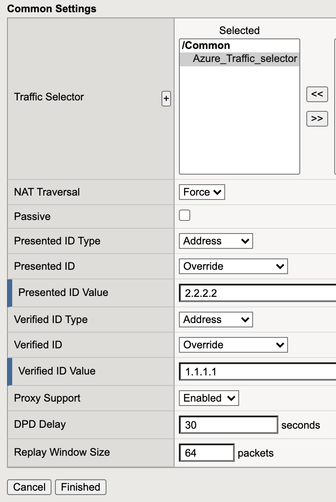

# Step 3: Create IKE Peer

## GUI configuration:

*Network->IPsec->IKE Peers*<br>
click create:<br>

### General Properties:

Settings on both instances have to be identical.<br> Pre-shared keys have to be identical.

| Azure BIG-IP | AWS BIG-IP  |
|---|---|
|  |  |

### IKE Phase1 Algorithms and credentials:

| Azure BIG-IP | AWS BIG-IP  |
|---|---|
|  |  |


### Common Settings:

 **"Presented ID Value"** is the public IP of the local BIG-IP. If the instance is in AWS, then the value is the public IP address of the Elastic IP. If the instance is in Azure, then the value is the public IP address that is mapped to the primary private IP of the networks interface.<br><br> **"Verified ID Value"** is the public IP address of the remote device. This is the incoming source IP the BIG-IP sees that establishes the IPsec tunnel.

| Azure BIG-IP | AWS BIG-IP  |
|---|---|
|  |  |


## TMSH Configuration

**Azure BIG-IP**

This is the example configuration via TMSH for the Azure BIG-IP

IPsec policy:
```
tmsh create net ipsec ipsec-policy Azure_IPsec_policy { mode tunnel tunnel-local-address 192.168.10.100 tunnel-remote-address 1.1.1.1 }
```

Traffic Selector:
```
tmsh create net ipsec traffic-selector Azure_Traffic_selector destination-address 10.0.0.0/16 ipsec-policy Azure_IPsec_policy source-address 192.168.0.0/16
```

IKE Peer:
```
 tmsh create net ipsec ike-peer AWS_IKE_peer version replace-all-with { v2 } remote-address 1.1.1.1 phase1-encrypt-algorithm aes256 phase1-auth-method pre-shared-key preshared-key "mysecretPresharedKey" traffic-selector add { Azure_Traffic_selector } nat-traversal force my-id-value 2.2.2.2 peers-id-value 1.1.1.1
 ```

<br><br>

**AWS BIG-IP:**

This is the example configuration via TMSH for the AWS BIG-IP

IPsec policy:
```
tmsh create net ipsec ipsec-policy AWS_IPsec_policy { mode tunnel tunnel-local-address 10.0.10.20 tunnel-remote-address 2.2.2.2 }
```

Traffic Selector:
```
tmsh create net ipsec traffic-selector AWS_Traffic_selector destination-address 192.168.0.0/16 ipsec-policy AWS_IPsec_policy source-address 10.0.0.0/16
```

IKE Peer:
```
 tmsh create net ipsec ike-peer Azure_IKE_peer version replace-all-with { v2 }remote-address 2.2.2.2 phase1-encrypt-algorithm aes256 phase1-auth-method pre-shared-key preshared-key "mysecretPresharedKey" traffic-selector add { AWS_Traffic_selector } nat-traversal force my-id-value 1.1.1.1 peers-id-value 2.2.2.2
 ```

***

[back](BIG-IP_traffic_selector.md)

[IPSec config overview page](BIG_IP_IPsec_config.md)

[troubleshooting IPsec tunnels](BIG_IP_troubleshoot_IPSec.md)