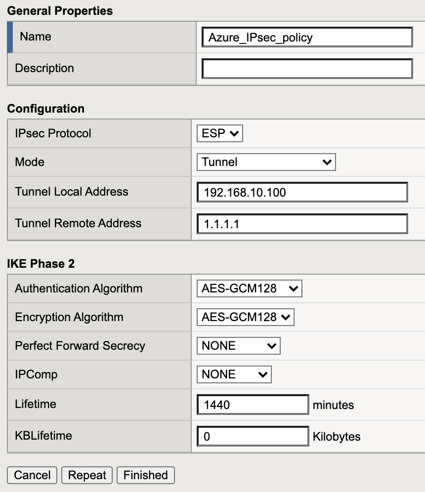
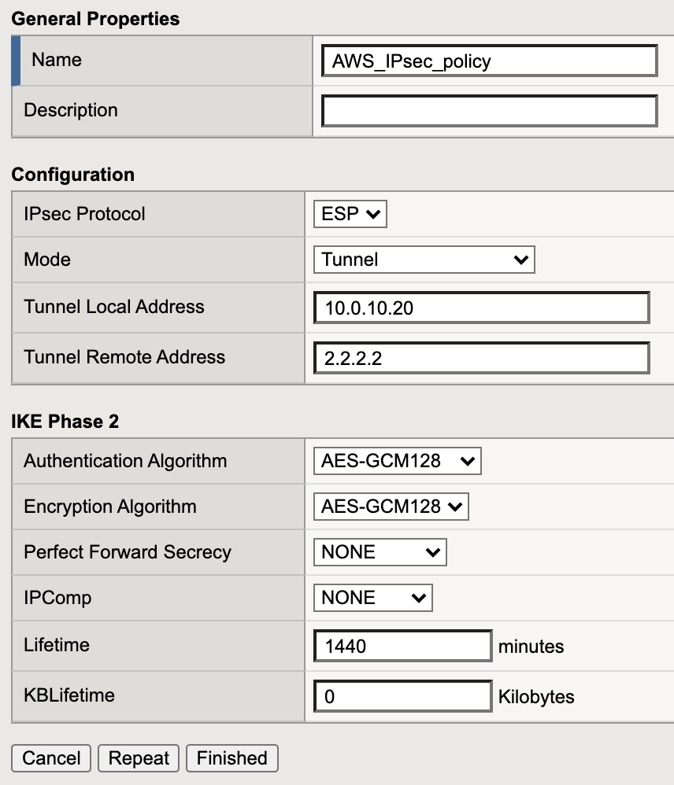

# Step 1: Create IPsec policy

The value for **"Tunnel Local Address"** is the primary self IP of the public VLAN of BIG-IP. It cannot be a floating IP address.

The value for **"Tunnel Remote Address"** is the public IP address of the remote BIG-IP.

## GUI configuration: 

Network->IPsec->IPsec Policy list<br>
click create:<br>

| Azure BIG-IP | AWS BIG-IP |
|---|---|
|   |   |


<br>

## TMSH configuration

Azure BIG-IP:

```
 tmsh create net ipsec ipsec-policy Azure_IPsec_policy { mode tunnel tunnel-local-address 192.168.10.100 tunnel-remote-address 1.1.1.1 }
```

AWS BIG-IP:

```
 tmsh create net ipsec ipsec-policy AWS_IPsec_policy { mode tunnel tunnel-local-address 10.0.10.20 tunnel-remote-address 2.2.2.2 }
```

***
[back](BIG_IP_IPsec_config.md) 

[next](BIG-IP_traffic_selector.md)
