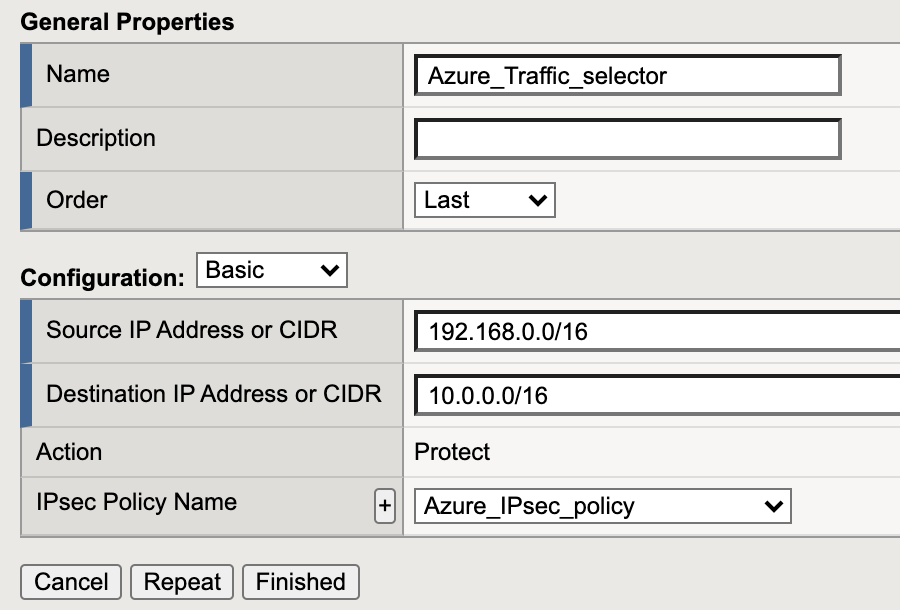
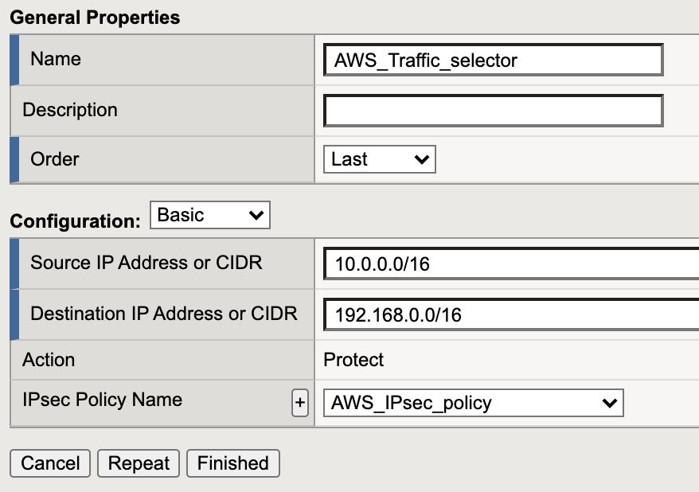

# Step 2: Create Traffic Selector

The traffic selector identifies which traffic to send through the IPsec tunnel.

**"Source IP Address or CIDR":** These are the source IP Addresses or networks that are allowed to send traffic through the IPsec tunnel. Usually these are local IP addresses to the BIG-IP or IP addresses that are reachable through this BIG-IP from the remote side.

**"Destination IP Address or CIDR":** Specifies the host or network IP address to which the application traffic is destined.

## GUI configuration:

Network->IPsec->Traffic Selectors<br>
click create:<br>

| Azure BIG-IP | AWS BIG-IP  |
|---|---|
|  | |

## TMSH configuration

Azure BIG-IP:

```
 tmsh create net ipsec traffic-selector Azure_Traffic_selector destination-address 10.0.0.0/16 ipsec-policy Azure_IPsec_policy source-address 192.168.0.0/16
```

AWS BIG-IP:

```
tmsh create net ipsec traffic-selector AWS_Traffic_selector destination-address 192.168.0.0/16 ipsec-policy AWS_IPsec_policy source-address 10.0.0.0/16
```

## Traffic selector Order

Check the order of the traffic selectors. The order is important, because BIG-IP selects traffic based on first match.

***
[back](BIG-IP_IPsec_policy.md)

[next](BIG-IP_IKE_peer.md)


