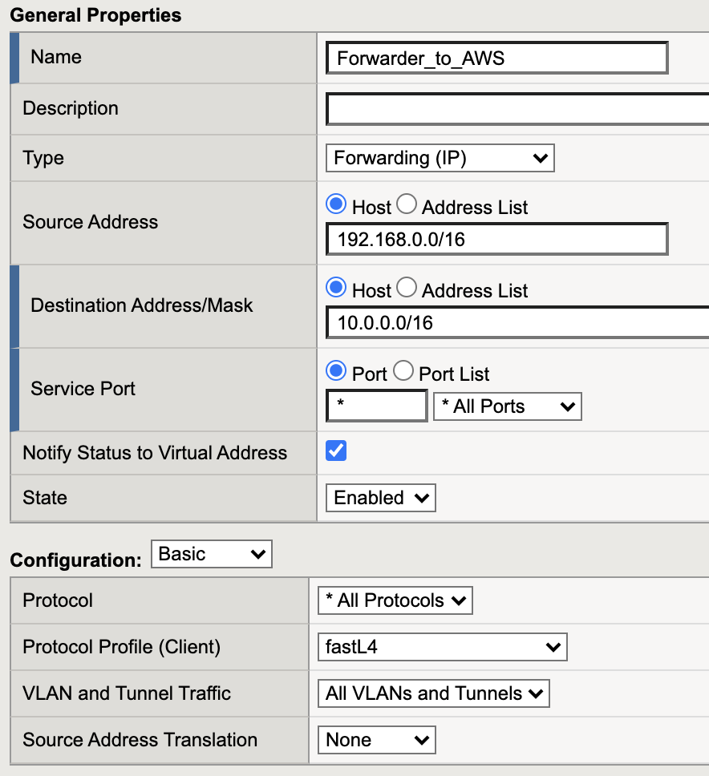
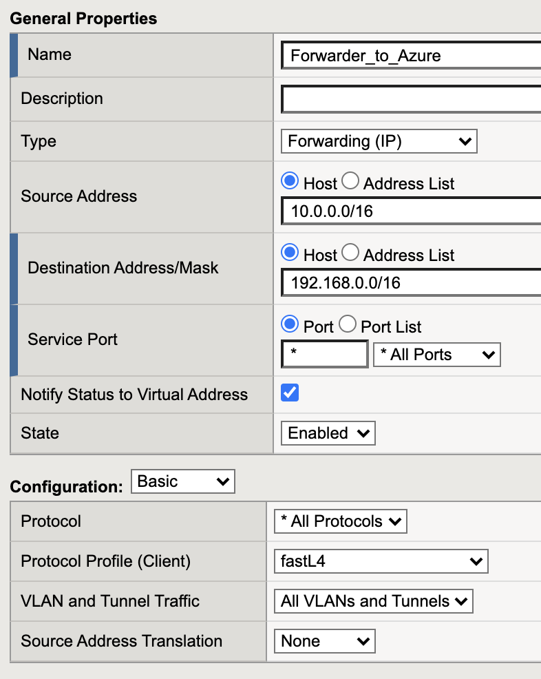
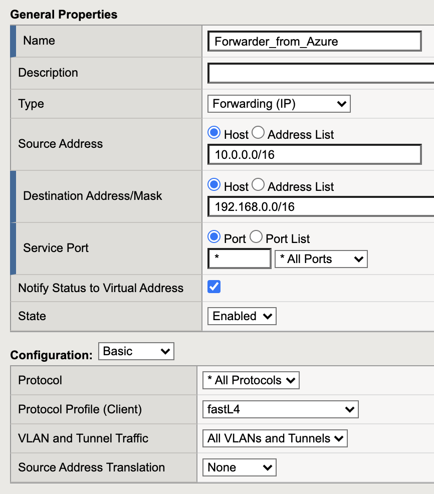
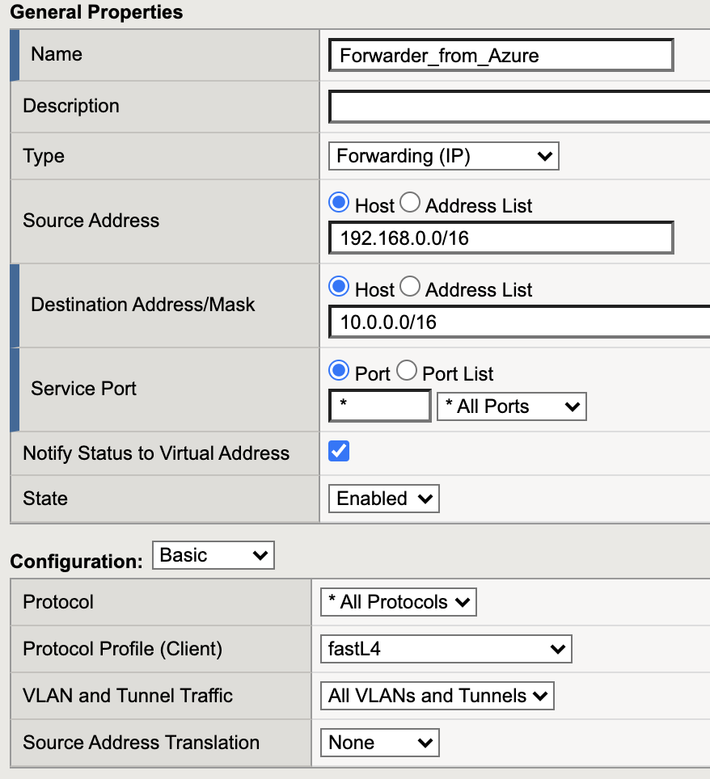
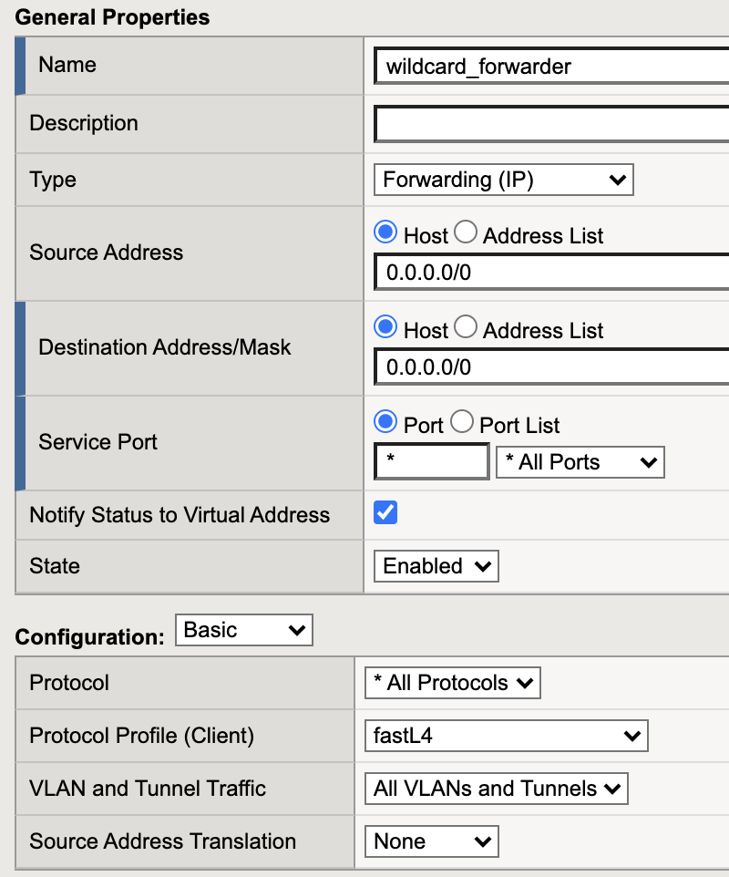

# Virtual server configuration

IPsec traffic needs to be routed through BIG-IP. Therefore BIG-IP requires one or two virtual servers to accept the routed application traffic.

The virtual server type should be "Forwarding IP".
The destination IP is the destination network with a 

| Azure BIG-IP | AWS BIG-IP | 
|--- |--- |
|  |  |

BIG-IP requires a forwarding virtual server for receiving traffic from the IPsec tunnel. The destination is the network that should be reachable from the remote location. 

| Azure BIG-IP | AWS BIG-IP | 
|--- |--- |
|  |  |

Alternatively a simple wildcard forwarding virtual Server can do the job as well:

| Azure BIG-IP | AWS BIG-IP | 
|--- |--- |
|  |  |

Only one Virtual server is needed. This wildcard forwarding virtual server will turn BIG-IP into a router.

***

[back](BIG_IP_troubleshoot_IPSec.md)

[IPSec config overview page](BIG_IP_IPsec_config.md)

[Go to Readme](../README.md)