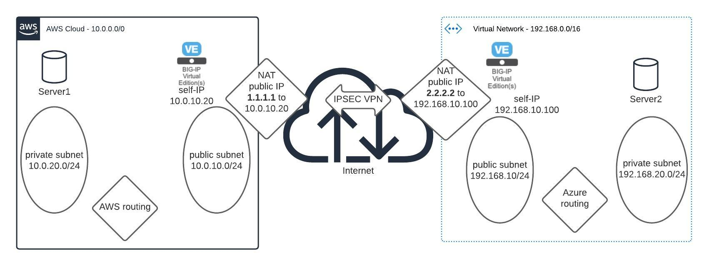

# BIG-IP and IPsec

IPsec configuration steps for BIG-IP.  
BIG-IP's are deployed in Azure and AWS.  
This architecture is equivalent to IPsec deployment with two BIG-IPs behind NAT Firewalls in traditional networks.

In case one side of the IPsec pairs is not a BIG-IP, please check this deployment guide:  
https://techdocs.f5.com/en-us/bigip-14-1-0/big-ip-tmos-tunneling-and-IPsec-14-1-0/configuring-IPsec-between-a-big-ip-system-and-a-third-party-device.html

Otherwise, this documentation is based on following ask.f5.com article: 
https://techdocs.f5.com/en-us/bigip-14-1-0/big-ip-tmos-tunneling-and-IPsec-14-1-0/setting-up-IPsec-to-use-nat-traversal-on-both-sides-of-the-wan.html

## Network Diagram overview

Network Diagram:

## Overview of Steps to setup IPsec between two BIG-IP instances behind NAT Firewalls:

 It is assumed that the network configuration is done before this step and that the BIG-IP can reach the public IP Address of it's IPsec peer.

To create an IPsec tunnel between two devices follow these steps:

1. [Create IPsec Policy](BIG-IP_IPsec_policy.md)
1. [Create Traffic Selector](BIG-IP_traffic_selector.md)
1. [Create IKE Peer](BIG-IP_IKE_peer.md)
1. [Create virtual server of type "IP forwarding" ](BIG-IP_virtual_server.md)

***

[back to README](../README.md)

[next](BIG-IP_IPsec_policy.md)